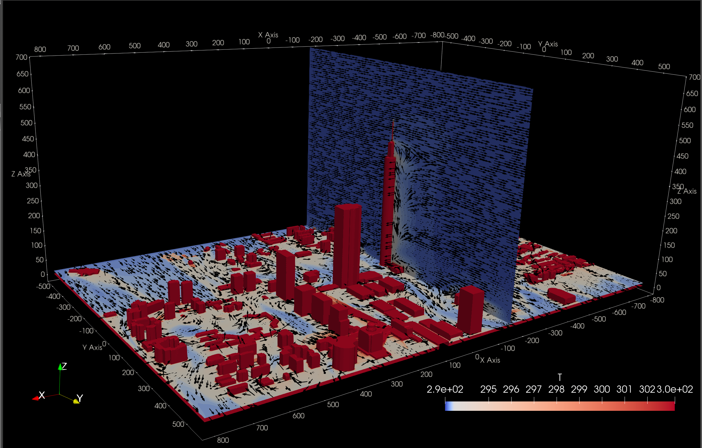
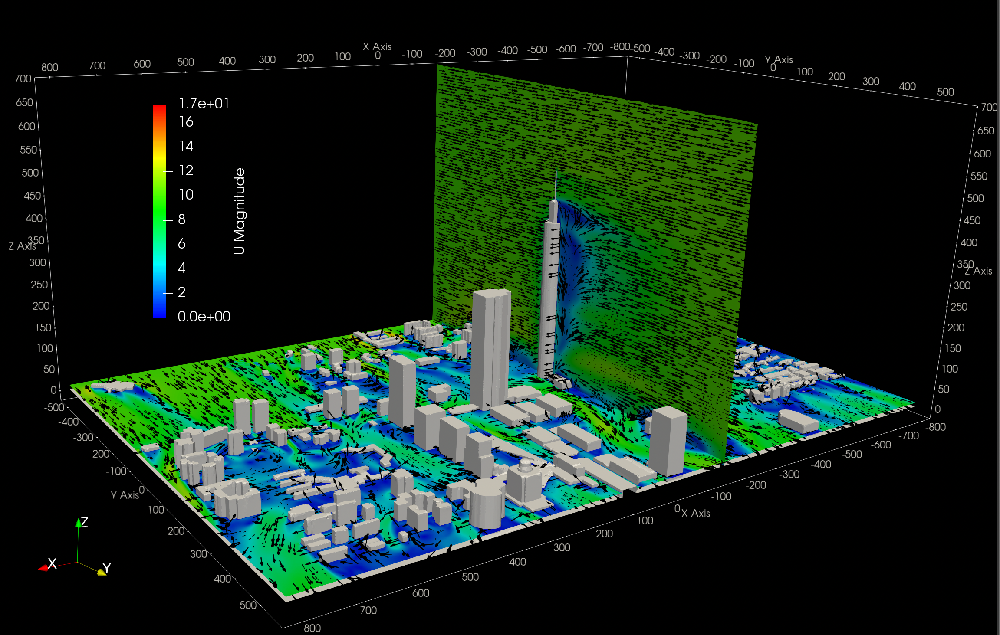
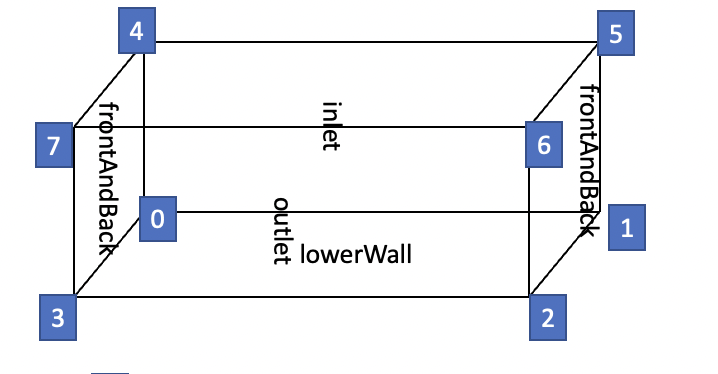

# OpenFOAM.buoyantBoussinesqSimpleFoam.windAroundBuildings

## Abstract

可以看到 OpenFOAM 官方練習檔案有一個檔案 叫做 `windAroundBuildings` 在資料夾 `$FOAM_TUTORIALS/incompressible/simpleFoam` ，這是一個很棒的範例模擬都市流場模擬，可惜 simpleFOAM 並沒有考慮到能量方程式。往往我們會很好奇溫度場影響，因此使用 solver `buoyantBoussinesqSimpleFoam` 重新模擬，平行計算使用在 `
snappyHexMesh` 以及 `buoyantBoussinesqSimpleFoam`

## 0.Results

## 1. Literature Review

### 1.1 PALM Model System

Finding an existing meteorological modelling system is a way to determine which solver in OpenFOAM is suitable. The PALM model system is one of them for atmospheric and oceanic boundary layer flows. Brief, The model can be utilised to dynamically solve the  N-S Equation, the first law of thermodynamics. In turbulent flow, LER and RANS are also included in the model.

### 1.2 Boussinesq Approximation 

In section 2.1 in the article, ["Overview of the PALM model system 6.0" [Björn Maronga et al.]](https://gmd.copernicus.org/articles/13/1335/2020/). The Boussinesq-approximated form is one of the default approximates. The Boussinesq approximated typical utilize to reduce the requirements and the degree of non-linearity for making the solver be more stable. However, there are some limitations to the approximation. For the air, the Boussinesq approximation is supported where the $\Delta T< 15^0$ and $M << 1$. On the other hand, $\Delta T>15^0$ or $M > 0.3$ is needed to use the entire compressible formulation. But, the initial solution still can use the  Boussinesq approximation for stability. 

### 1.3 OpenFOAM

For solveing the N-S Eq and contunity equation.  SIMPLE and PISO are often used for stead-state flows and transient flows, respectively. As a result, the The the solver with SIMPLE algorithm are been chosen. 

Following procedure use to brief introducting of solving governing equations.

The continuity equation, 
$$
\nabla \cdot {U} = 0        
$$ 
, and **incompressible** N-S quation
$$
{U} \cdot \nabla  {U} -\nabla \cdot (\nu \nabla {U} )= -\nabla p 
$$ where  $p$ is the kinematic pressure which equal to $p/ρ$, and $ν$ is kinematic viscosity. The convection term in the momentum equations $\nabla⋅(UU)$ is a non-linear equation. Addiitonally, there are four unknows ($U_x, U_y, U_z, p$) and four euqaiotn. 

Convert the momentum equation to the general equation form (semi-discretized form of the momentum equations).

$$
M {U} = -\nabla p
$$ `1`
$M$ is a matrix of coefficients that are calculated by discretising the term in the equation. Considering a diagonal matrix is easy to invert, convert the equation $M {U} = -\nabla p$ to 

$$
AU - H = -\nabla p, 
$$

where $A$ is diagonal matrix. 

The matrix $H$ is evaluated explicitly from the off-diaonal terms and the velocity $U$, is from the previous iteration.
> $H = AU - MU$ 

> $AU = H - \nabla p$
> $U = A^{-1}  H - A^{-1}  \nabla p \longrightarrow (III)$  
> $\nabla \cdot U = \nabla \cdot [ A^{-1}  H -A^{-1}  \nabla p ]$ => continuity Eq.
> $0 = \nabla \cdot [ A^{-1}  H -A^{-1}  \nabla p ]$ 

Poisson equation got for pressure
$$
\nabla \cdot (A^{-1}\nabla p) = \nabla \cdot (A^{-1} H)  \longrightarrow (II)
$$

-------

Fot the solution process, firstly solve the semi-decretize form of momentum equation for the velocity field.

$$MU = - \nabla p$$
Then, the sovle the Poisson equation for the pressure field 

$$\nabla \cdot (A^{-1} \nabla p) = \nabla \cdot (A ^{-1} H ) $$

Use the pressure field to correct the velocity field so that it satisfies the continuity equation. 
$$U=A^{-1} H-A^{-1} ∇p$$

For the velocity field now un-satisfing the momentum equations, repeat the cycle.

$$
M_E E = S_E
$$

$$
M_k k = S_k
$$

$$
M_\epsilon \epsilon = S_\epsilon
$$

where, the E represtents the energy. The tubulence scalar ($k, \epsilon, \omega$).

## Domain and Boundary Conditions

#### For the inlet boundary condition,
the velocity field uses a first boundary, Dirichlet boundary condition, is employed the inlet velocity is a constat 10 m/s (36 km /min).
The pressure boundary condition is `total_pressure` which is second boundary condition making the solver more stable. 
In this boundary condition, a static pressure at the patch, $p_p$, dectribed by substracting the dynamic pressure ($\frac{1}{2} |u|^2$) form the total pressure.
> $p_p = p_0 - \frac{1}{2} |u|^2$

The turbulence intensity needs to be estimated for the inlet boundary condition. Typically the high-turbulence case, such as high-speed flow inside complex geometries like heat-exchangers, the $I$ is between 5% and 20%.For isotropic turbulence, the turbulent kinetic energy can be estimated by $k = \frac{3}{2}(I |U_{ref}|)^2$, where $I = 0.1$, and $U_{ref}$, a reference flow speed, is inlet velocity speed 10m/s. After calculating, the $k$ is estimated as 1.5. In additional, the turbulence dissipation rate can be estimated $\epsilon = \frac{C_\mu^{0.75} k^{1.5}}{L}$, where $C_\mu$ is a model constant 0.09 by default, and $L$ is a reference length scale. Finally, epsilonlent is estimated to be 0.3.

| B.C.                      | Parameter |
|---------------------------|-----------|
| $U$ =  (10 0 0)           | U         |
| totalPressure p0 = 0;     | P         |
| fixedValue = epsilonInlet  | epsilon   |
| fixedValue = 1.5           | k         |
| Calculated; Val = 0       | nut       |
| calculated; Val = 0       | alpha     |
| zeroGradient              | T         |

#### For the outlet boundary condition,
the velocity field still uses a first boundary, `noSlip` boundary condition. The pressure boundary condition is `total_pressure` for `p`. Additionally,  `fixedFluxPressure` for `p_rgh` which is second boundary condition have easy to convergence.  

| B.C.                                                          | Parameter |
|---------------------------------------------------------------|-----------|
| `pressureInletOutletVelocity`; Val = (0, 0, 0)                | U         |
| `totalPressure` ;p0 = 0;                                      | P         |
| `totalPressure` ;p0 = 0; Val = 0;                             | p_rgh     |
| `inletOutlet` ;inletVal = `epsilonInlet`                      | epsilon   |
| `inletOutlet` ;inletVal = 1.5                                 | k         |
| `Calculated`; Val = 0                                         | nut       |
| `calculated`; Val = 0                                         | alpha     |
| `zeroGradient`                                                | T         |

#### For the wall boundary conditions,
 the velocity field uses a no-slip boundary condition on the ground and buildings.

> $u_i = 0,  i = 1~3$

The pressure boundary condition are employied zeroGradient. 
 > $\partial p/\partial x_i, i = 1~3$

For hydrostatic pressure in OpenFOAM such as buoyant and multiphase cases. 

The hydrostatic pressure, $p'$ named `p_rgh`, substitutes, the pressure $p$ into the momentum equation for numerically convenient.  
It is defined as $p' = p - \rho( g \cdot h)$

In the example of the buoyant case in OpenFOAM, the `fixedFluxPressure` boundary condition for `p_rgh` usually is employed. Additionally, some articles on CFD online claim that `fixedFluxPressure` is more stable and has better convergence. This boundary condition sets the pressure gradient to the provided value such that the flux on the boundary is specified by the velocity boundary condition. On the other hand, when the value is zero, the boundary condition is used for pressure `zeroGradient`, but where the body forces accrue, the condition is adjusted accordingly.

The  boundary condition, `kqRWallFunctiont`, for k turbulente kinetic energy. The boundary condition, `nutkWallFunction`, for nut. 

For the boundary condition for $\alpha$, `alphatJayatillekeWallFunction` is employed, and all parameters use the default. such as turbulent prandtl number, prt = 0.86. The latest but not least is the temperature, ' T`, is constant, being 303.15k.

| B.C.                                       | Parameter |
|--------------------------------------------|-----------|
| `noSlip`                                     | U         |
| `zeroGradient`                               | P         |
| `fixedFluxPressure`; Val  = 0                  | p_rgh     |
| `epsilonWallFunction`; Value = `epsilonInlet` | epsilon   |
| `kqRWallFunctiont`                            | k         |
| `nutkWallFunction`; Val = 0                   | nut       |
| `alphatJayatillekeWallFunction`; prt  = 0.85 | alpha     |
| T = 300.15                                   | T         |

### For the upperWall and frontAndBack

There are symmerty plan boundary condition.

### For the internal Field , initional

| Internal Field | Parameter |
|----------------|-----------|
| 0, 0, 0        | U         |
| 0              | P         |
| `epsilonInlet` | epsilon   |
| $kInlet        | k         |
| 0              | nut       |
| 0              | alpha     |
|  293.15       | T         |
| T = 300.15     | T         |

## Setting

* solver: buoyantBoussinesqSimpleFoa
* time schemes: steadyState
* turbulence : RAS: RNGkEpsilon

* gradient schemes: grad(U), grad(p)
* divergence schemes: div(phi,U)
<!-- * note: Bounded schemes for steady state -->
* laplacian schemes: laplacian(nuEff,U), laplacian((1|A(U)),p)

- Divergence schemes
    - div(phi, epsiolon) bounded Gauss linearUpwind grad(epsilon)
    - div(phi, U) bounded Gauss linearUpwindV grad(U);
    - div((nuEff*dev2(T(grad(U)))) bounded Gauss linear;
    - div(phi, k) bounded Gauss linearUpwind grad(k);
    - div(phi, T) bounded Gauss linearUpwind default;

- Gradient schemes
        -  cellLimited leastsquares 1;
